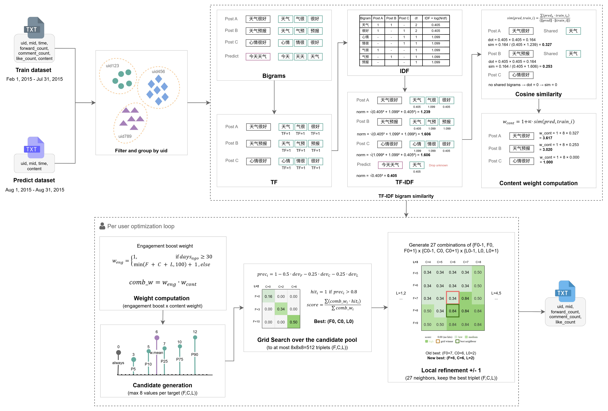

# Weibo Engagement Prediction — Pipeline v8

## Overview

This project predicts Weibo post engagement (forwards, comments, likes) for the
**Aliyun Tianchi Challenge: Weibo User Post Engagement Prediction**.

**Competition link:** https://tianchi.aliyun.com/competition/entrance/231574/information

---

## Competition Setup

| Split | Period | Purpose |
|---|---|---|
| Training | Feb – Jul 2015 | Learn per-user engagement patterns |
| Prediction | Aug 2015 | Produce one (F, C, L) triplet per test post |

**Evaluation metric — weighted hit rate:**

```
precision_i = 1 - 0.5 * |F - tf| / (tf + 5)
                - 0.25 * |C - tc| / (tc + 3)
                - 0.25 * |L - tl| / (tl + 3)

hit_i   = 1  if  precision_i > 0.8
weight_i = min(tf + tc + tl, 100) + 1

score = sum(weight_i * hit_i) / sum(weight_i)
```

A prediction is a **hit** when its (F, C, L) triplet is within ~20% of the true
values on each dimension (with small-count smoothing). High-engagement posts carry
more weight (capped at 101).

---

## Algorithm



v8 is a **per-user, per-post** model. For each prediction post it finds the
(F, C, L) integer triplet that maximises the weighted hit rate across all of
that user's historical posts, using content similarity to the prediction post
as an additional weight signal.

### Step 1 — Compute per-post content weights (TF-IDF bigram cosine)

For each user, a per-user IDF is built over all training post contents:

```
idf(bg) = log(N / df(bg))    for bigrams appearing in fewer than N posts
         (bigrams in ALL posts get idf=0, filtering out common filler)
```

For each prediction post `p`, cosine similarity against each training post `t`:

```
sim(p, t) = dot(tfidf(p), tfidf(t)) / (||tfidf(p)|| * ||tfidf(t)||)

w_content(p, t) = 1 + ALPHA * sim(p, t)     ALPHA = 12.0
```

This up-weights training posts that are topically similar to the prediction post,
so the model predicts engagement patterns from the most relevant past posts.

### Step 2 — Compute combined post weights

Each historical post `i` receives a combined weight:

```
w_engage_i  = min(tf+tc+tl, 100) + 1  if days_ago_i <= RECENCY_WINDOW
            = 1                         otherwise

combined_i  = w_engage_i * w_content_i
```

No exponential recency decay is applied (ablation showed it hurts). The engagement
boost is restricted to the last `RECENCY_WINDOW` days to avoid old high-engagement
spikes dominating.

Parameters:
- `RECENCY_WINDOW = 30.0` days — window for full engagement weighting
- `ALPHA = 12.0` — TF-IDF content similarity multiplier

### Step 3 — Build candidate pools

For each of the three dimensions (F, C, L), a small set of up to 8 integer
candidates is built from the user's history:

```
candidates = {0} ∪ {weighted_mean} ∪ {p5, p10, p25, p50, p75, p90}
```

- `0` is included because the majority of posts have zero engagement.
- The weighted mean uses `combined_i` as weights.
- Percentiles are unweighted (capture the shape of the raw distribution).
- `p5` and `p10` provide low-end anchors for users with mostly low-engagement posts.

### Step 4 — Vectorised grid search

All combinations of the three candidate pools are scored in a single NumPy
matrix operation (up to 8³ = 512 triplets):

```python
# (n_cands, 1) broadcast against (1, n_posts)
dev_f = |F - fwd| / (fwd + 5)
dev_c = |C - cmt| / (cmt + 3)
dev_l = |L - lke| / (lke + 3)

prec  = clip(1 - 0.5*dev_f - 0.25*dev_c - 0.25*dev_l, 0, inf)
hit   = (prec > 0.8)
score = sum(combined_w * hit, axis=posts) / sum(combined_w)
```

The triplet with the highest score is selected as `(F0, C0, L0)`.

### Step 5 — Local refinement (±2)

After the grid search, all 125 neighbours within ±2 are evaluated:

```
for dF in {-2, -1, 0, +1, +2}:
  for dC in {-2, -1, 0, +1, +2}:
    for dL in {-2, -1, 0, +1, +2}:
      score (max(0, F0+dF), max(0, C0+dC), max(0, L0+dL))
```

The best-scoring triplet (grid or neighbour) is kept. Expanded from ±1 (v7) to ±2 (v8).

---

## Competition Score History

| Version | Competition score | Key change |
|---|---|---|
| v3 | 0.3127 | Baseline: recency×engagement weights, grid search, ±1 refinement |
| v4 | 0.3090 | Weighted percentiles, ±2 refinement, more candidates (hurt) |
| v5 | 0.3115 | Iterative hill climbing (overfits, hurt) |
| v6 | 0.3098 | Exact sweep-line coordinate descent (overfits, hurt) |
| v7 | 0.3080 | hl=180, rw=7 from CV sweep (CV misleading, worst) |
| v8 | 0.3093 | Added p95, p99 candidates (hurt) |
| v9 | 0.3126 | Per-post bigram Jaccard similarity (no signal, neutral) |
| v10 | 0.3139 | TF-IDF bigram cosine similarity, ALPHA=3 (first improvement) |
| v11 | 0.3102 | + temporal features, pred-relative days_ago (hurt) |
| v12 | 0.3144 | ALPHA=5, added p10 candidate |
| v13 | 0.3147 | ALPHA=8, added p5 candidate |
| v14 | 0.3144 | Bigram+trigram (trigrams too sparse for short posts, hurt) |
| v15 | 0.3144 | ALPHA=12 (over-concentrates weight with decay, peaked at 8) |
| v16 | 0.3146 | Sublinear TF log(1+tf) (marginal, bigrams short enough) |
| v7* | 0.3149 | ALPHA=12 + no recency decay (ablation-guided) |
| **v8*** | **0.3157** | **±2 local refinement (ablation-guided, best)** |

*v7/v8 in the pipeline file naming correspond to the post-v16 ablation-guided versions.

---

## Ablation Study Results

Three rounds of ablation on a Jun-2015 held-out split (3,000 sampled users):

### Round 1 — v13 baseline components

| Component removed | Val score | Δ |
|---|---|---|
| v13 baseline (ALPHA=8, decay, rw=30) | 0.3606 | — |
| No recency window | 0.3471 | −0.0136 |
| Flat weights (no recency at all) | 0.3462 | −0.0144 |
| No content (ALPHA=0) | 0.3544 | −0.0063 |
| No ±1 local refinement | 0.3579 | −0.0028 |
| **No recency decay** | **0.3660** | **+0.0054** |
| **ALPHA=12** | **0.3646** | **+0.0039** |

### Round 2 — ALPHA and RECENCY_WINDOW sweep (v7 baseline)

| Variant | Val score | Δ |
|---|---|---|
| v7 baseline (ALPHA=12, no decay, rw=30) | 0.3678 | — |
| ALPHA=8 | 0.3660 | −0.0018 |
| ALPHA=16 | 0.3674 | −0.0004 |
| ALPHA=20 | 0.3675 | −0.0003 |
| rw=7d | 0.3522 | −0.0156 |
| rw=60d | 0.3567 | −0.0112 |
| **±2 local refinement** | **0.3680** | **+0.0002** |

### Round 3 — v8 baseline components

| Variant | Val score | Δ |
|---|---|---|
| v8 baseline (ALPHA=12, no decay, rw=30, ±2) | 0.3680 | — |
| ±1 refinement | 0.3678 | −0.0002 |
| ±3 refinement | 0.3649 | −0.0031 |
| top-k=50 (similarity filtering) | 0.3622 | −0.0058 |
| top-k=20 | 0.3523 | −0.0157 |
| Weighted percentiles | 0.3536 | −0.0144 |
| Add p1+p2+p3 (MAX=11) | 0.3680 | ±0 |
| Engagement cap=50 | 0.3620 | −0.0061 |

All remaining levers show no improvement — v8 parameters appear near-optimal.

---

## Data Format

### Training data — tab-separated, 7 columns
```
uid  mid  time  forward_count  comment_count  like_count  content
```

### Prediction data — tab-separated, 4 columns
```
uid  mid  time  content
```

### Output — tab-separated
```
uid  mid  forward_count,comment_count,like_count
```

---

## Quick Start

### Install dependencies
```bash
pip install -r requirements.txt
```

### Run
```bash
python weibo_pipeline_v8.py
```

Output is written to `Weibo Data/weibo_result_data/weibo_result_data_v8.txt`.

### Run on HPC (SLURM)
```bash
chmod +x run_pipeline.sh
sbatch run_pipeline.sh
```

---

## Key Parameters

| Parameter | Value | Effect |
|---|---|---|
| `RECENCY_WINDOW` | 30 days | Posts within this window get full engagement weighting |
| `MAX_CANDS` | 8 | Maximum candidates per dimension in grid search |
| `ALPHA` | 12.0 | TF-IDF content similarity multiplier |
| Local refinement | ±2 | Neighbourhood search radius after grid search |

---

## File Structure

```
weibo-baseline/
├── weibo_pipeline_v8.py          # Current best pipeline (score 0.3157)
├── weibo_pipeline_v7.py          # Previous best (score 0.3149)
├── weibo_pipeline_v6.py          # v13 equivalent (score 0.3147)
├── weibo_pipeline_v3.py          # Original baseline (score 0.3127)
├── weibo_ablation.py             # Ablation study script
├── ablation_results.txt          # Round 1 ablation results
├── ablation_results_sweep2.txt   # Round 2 ablation results
├── ablation_results_sweep3.txt   # Round 3 ablation results
├── run_pipeline.sh               # SLURM batch script
├── requirements.txt              # Python dependencies
├── README.md                     # This file
└── Weibo Data/
    ├── weibo_train_data/
    │   └── weibo_train_data.txt  # Training dataset (~1.2M rows)
    ├── weibo_predict_data/
    │   └── weibo_predict_data.txt # Test dataset (~177K rows)
    └── weibo_result_data/
        └── weibo_result_data_v8.txt  # v8 predictions (best)
```

---

## Requirements

- Python 3.7+
- numpy >= 1.21.0
- pandas >= 1.3.0

---

## Author

Developed for the Aliyun Tianchi Weibo Challenge.

## License

Competition project — refer to competition terms and conditions.
